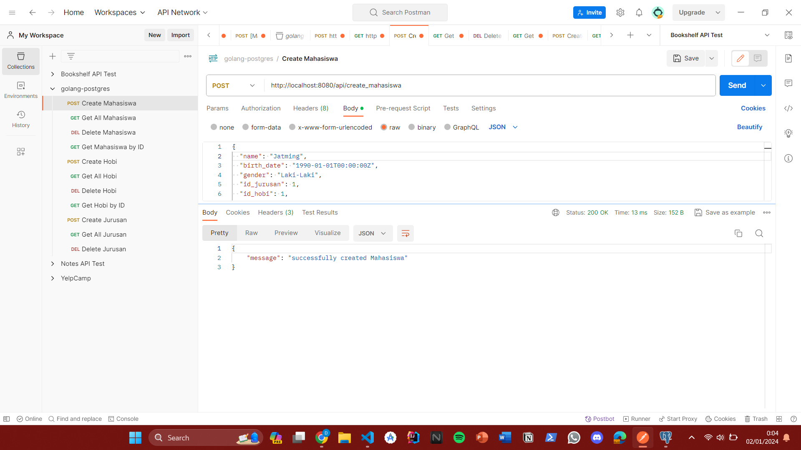
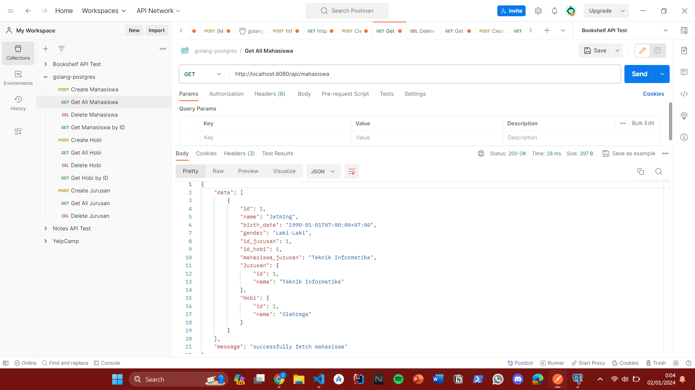
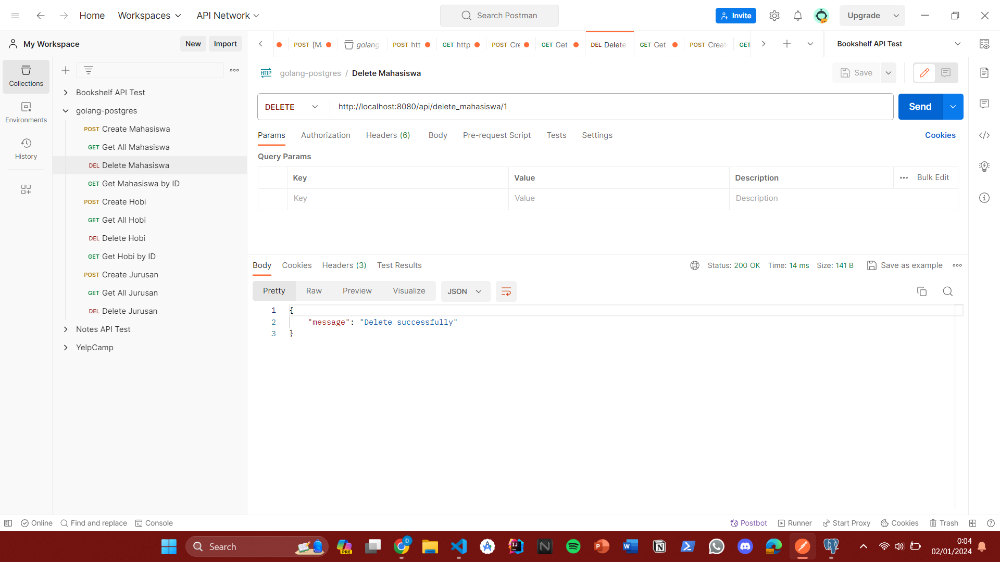
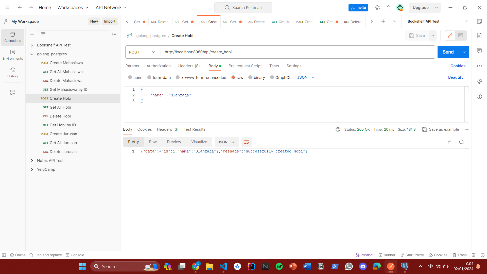
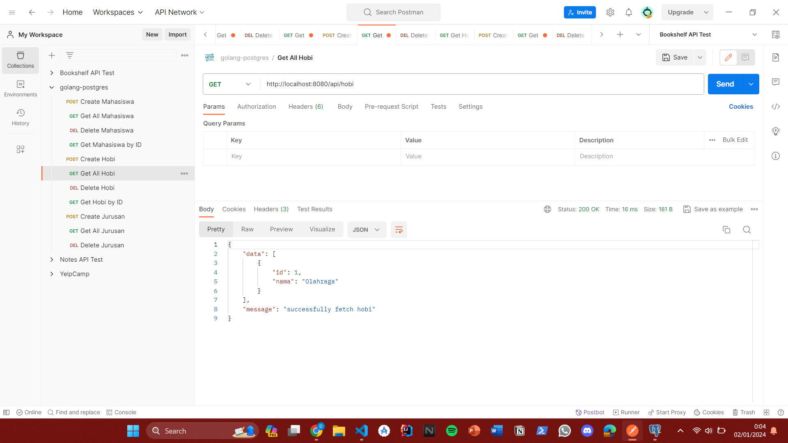
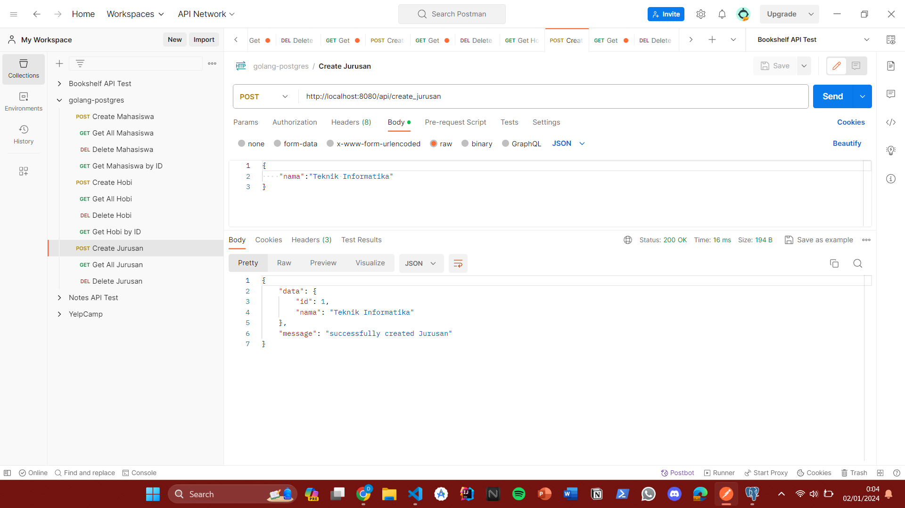
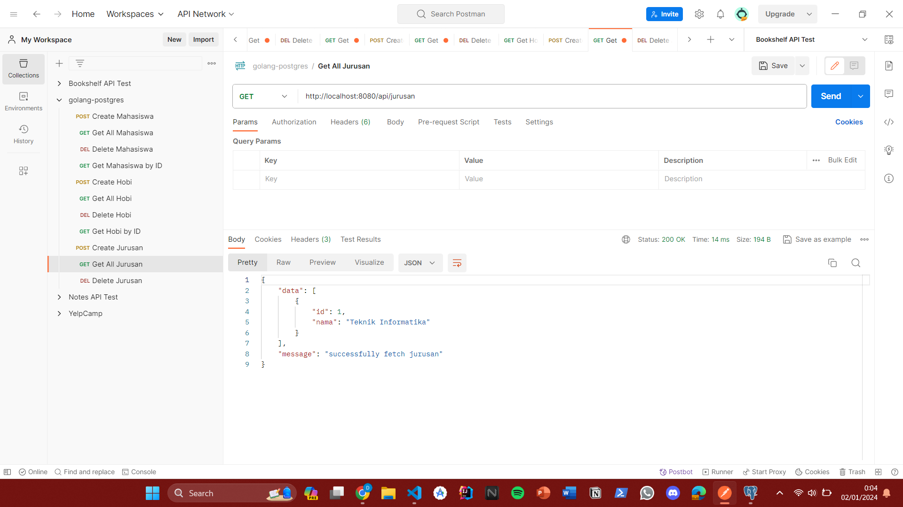
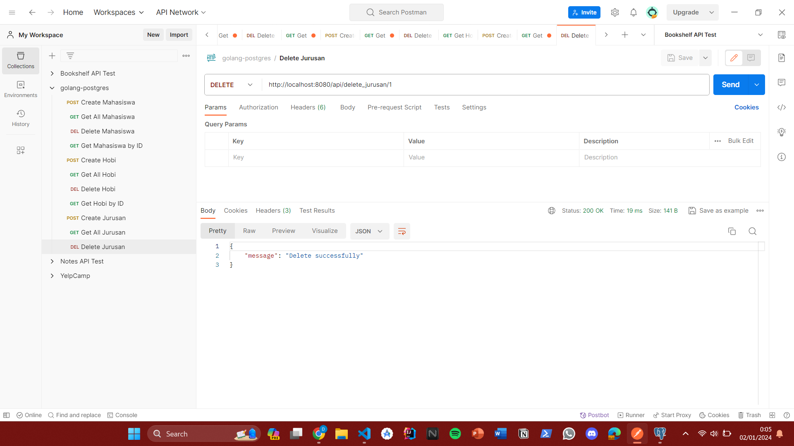

# REST Golang Postgres

Proyek ini merupakan implementasi REST API sederhana menggunakan Golang dan PostgreSQL dengan menggunakan framework Fiber.

## Instalasi

1. Clone repositori ini ke dalam direktori lokal:

   ```bash
   git clone https://github.com/DaffaJatmiko/rest-golang-postgres.git
   ```

2. Masuk ke direktori proyek:

   ```bash
   cd rest-golang-postgres
   ```

3. Buat file `.env` berdasarkan contoh di `.env.example` dan sesuaikan dengan konfigurasi PostgreSQL Anda.

4. Install dependencies:

   ```bash
   go get
   ```

5. Jalankan program:

   ```bash
   go run main.go
   ```

Proyek sekarang akan berjalan di http://localhost:8080.

## Struktur Proyek

- `main.go`: Poin masuk utama aplikasi.
- `storage/postgres.go`: Konfigurasi koneksi dan migrasi basis data PostgreSQL.
- `models/mahasiswa.go`: Definisi model Mahasiswa, Jurusan, dan Hobi.
- `tests/main_test.go`: File untuk pengujian unit.
- `api/routes.go`: Definisi rute API menggunakan framework Fiber.

## REST API

### Mahasiswa

#### Create Mahasiswa

Endpoint: `POST /api/create_mahasiswa`

#### Get All Mahasiswa

Endpoint: `GET /api/mahasiswa`

#### Get Mahasiswa by Id

Endpoint: `GET /api/get_mahasiswa/:id`

#### Delete Mahasiswa

Endpoint: `Delete /api/delete_mahasiswa/:id`

### Hobi

#### Create Hobi

Endpoint: `POST /api/create_hobi`

#### Get Hobi

Endpoint: `GET /api/hobi`

#### Delete Hobi

Endpoint: `DELETE /api/delete_hobi/:id`

### Jurusan

#### Create Jurusan

Endpoint: `POST /api/create_jurusan`

#### Get Jurusan

Endpoint: `DELETE /api/jurusan`

#### Delete Jurusan

Endpoint: `DELETE /api/delete_jurusan/:id`

## Pengujian Postman

Berikut adalah screenshoot dari pengujian menggunakan Postman untuk setiap endpoint API:

### Create Mahasiswa



### Get All Mahasiswa



### Delete Mahasiswa



### Create Hobi



### Get Hobi



### Delete Hobi


### Create Jurusan



### Get Jurusan



### Delete Jurusan


